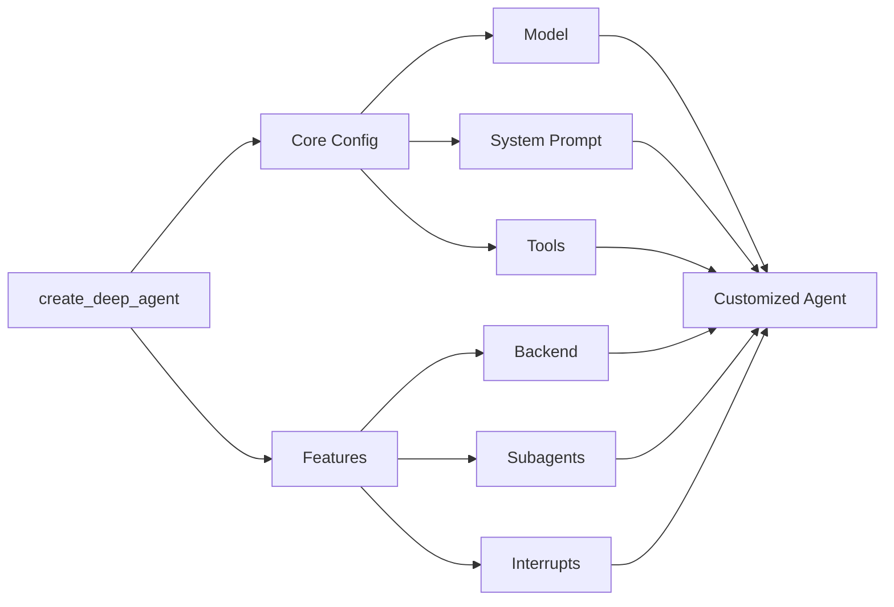

> ## Documentation Index
> Fetch the complete documentation index at: https://docs.langchain.com/llms.txt
> Use this file to discover all available pages before exploring further.

# Customize Deep Agents

> Learn how to customize deep agents with system prompts, tools, subagents, and more



## Model

By default, `deepagents` uses [`claude-sonnet-4-5-20250929`](https://platform.claude.com/docs/en/about-claude/models/overview). You can customize the model used by passing any supported <Tooltip tip="A string that follows the format `provider:model` (e.g. openai:gpt-5)" cta="See mappings" href="https://reference.langchain.com/python/langchain/models/#langchain.chat_models.init_chat_model(model)">model identifier string</Tooltip> or [LangChain model object](/oss/python/integrations/chat).

<Tip>
  Use the `provider:model` format (e.g., `openai:gpt-5`) to quickly switch between models.
</Tip>

<CodeGroup>
  ```python Model string theme={null}
  from langchain.chat_models import init_chat_model
  from deepagents import create_deep_agent

  model = init_chat_model(model="openai:gpt-5")
  agent = create_deep_agent(model=model)
  ```

  ```python LangChain model object theme={null}
  # ollama pull llama3.1
  from langchain_ollama import ChatOllama
  from langchain.chat_models import init_chat_model
  from deepagents import create_deep_agent

  model = init_chat_model(
      model=ChatOllama(
          model="llama3.1",
          temperature=0,
          # other params...
      )
  )
  agent = create_deep_agent(model=model)
  ```
</CodeGroup>

## System prompt

Deep agents come with a built-in system prompt inspired by Claude Code's system prompt. The default system prompt contains detailed instructions for using the built-in planning tool, file system tools, and subagents.

Each deep agent tailored to a use case should include a custom system prompt specific to that use case.

```python  theme={null}
from deepagents import create_deep_agent

research_instructions = """\
You are an expert researcher. Your job is to conduct \
thorough research, and then write a polished report. \
"""

agent = create_deep_agent(
    system_prompt=research_instructions,
)
```

## Tools

In addition to custom tools you provide, deep agents include [built-in tools](/oss/python/deepagents/overview#core-capabilities) for planning, file management, and subagent spawning.

```python  theme={null}
import os
from typing import Literal
from tavily import TavilyClient
from deepagents import create_deep_agent

tavily_client = TavilyClient(api_key=os.environ["TAVILY_API_KEY"])

def internet_search(
    query: str,
    max_results: int = 5,
    topic: Literal["general", "news", "finance"] = "general",
    include_raw_content: bool = False,
):
    """Run a web search"""
    return tavily_client.search(
        query,
        max_results=max_results,
        include_raw_content=include_raw_content,
        topic=topic,
    )

agent = create_deep_agent(
    tools=[internet_search]
)
```

## Skills

You can use [skills](/oss/python/deepagents/overview) to provide your deep agent with new capabilities and expertise.
While [tools](/oss/python/deepagents/customization#tools) tend to cover lower level functionality like native file system actions or planning, skills can contain detailed instructions on how to complete tasks, reference info, and other assets, such as templates.
These files are only loaded by the agent when the agent has determined that the skill is useful for the current prompt.
This progressive disclosure reduces the amount of tokens and context the agent has to consider upon startup.

For example skills, see [Deep Agent example skills](https://github.com/langchain-ai/deepagentsjs/tree/main/examples/skills).

To add skills to your deep agent, pass them as an argument to `create_deep_agent`:

<Tabs>
  <Tab title="StateBackend">
    ```python  theme={null}
    from urllib.request import urlopen
    from deepagents import create_deep_agent
    from langgraph.checkpoint.memory import MemorySaver

    checkpointer = MemorySaver()

    skill_url = "https://raw.githubusercontent.com/langchain-ai/deepagentsjs/refs/heads/main/examples/skills/langgraph-docs/SKILL.md"
    with urlopen(skill_url) as response:
        skill_content = response.read().decode('utf-8')

    skills_files = {
        "/skills/langgraph-docs/SKILL.md": skill_content
    }

    agent = create_deep_agent(
        skills=["./skills/"],
        checkpointer=checkpointer,
    )

    result = agent.invoke(
        {
            "messages": [
                {
                    "role": "user",
                    "content": "What is langgraph?",
                }
            ],
            # Seed the default StateBackend's in-state filesystem (virtual paths must start with "/").
            "files": skills_files
        },
        config={"configurable": {"thread_id": "12345"}},
    )
    ```
  </Tab>

  <Tab title="StoreBackend">
    ```python  theme={null}
    from urllib.request import urlopen
    from deepagents import create_deep_agent
    from deepagents.backends import StoreBackend
    from langgraph.store.memory import InMemoryStore


    store = InMemoryStore()

    skill_url = "https://raw.githubusercontent.com/langchain-ai/deepagentsjs/refs/heads/main/examples/skills/langgraph-docs/SKILL.md"
    with urlopen(skill_url) as response:
        skill_content = response.read().decode('utf-8')

    store.put(
        namespace=("filesystem",),
        key="/skills/langgraph-docs/SKILL.md",
        value=skill_content
    )

    agent = create_deep_agent(
        backend=(lambda rt: StoreBackend(rt)),
        store=store,
        skills=["./skills/"]
    )

    result = agent.invoke(
        {
            "messages": [
                {
                    "role": "user",
                    "content": "What is langgraph?",
                }
            ]
        },
        config={"configurable": {"thread_id": "12345"}},
    )
    ```
  </Tab>

  <Tab title="FilesystemBackend">
    ```python  theme={null}
    from deepagents import create_deep_agent
    from langgraph.checkpoint.memory import MemorySaver
    from deepagents.backends.filesystem import FilesystemBackend

    # Checkpointer is REQUIRED for human-in-the-loop
    checkpointer = MemorySaver()

    agent = create_deep_agent(
        backend=FilesystemBackend(root_dir="/Users/user/{project}"),
        skills=["/Users/user/{project}/skills/"],
        interrupt_on={
            "write_file": True,  # Default: approve, edit, reject
            "read_file": False,  # No interrupts needed
            "edit_file": True    # Default: approve, edit, reject
        },
        checkpointer=checkpointer,  # Required!
    )

    result = agent.invoke(
        {
            "messages": [
                {
                    "role": "user",
                    "content": "What is langgraph?",
                }
            ]
        },
        config={"configurable": {"thread_id": "12345"}},
    )
    ```
  </Tab>
</Tabs>

## Memory

Use [`AGENTS.md` files](https://agents.md/) to provide extra context to your deep agent.

You can pass one or more file paths to the `memory` parameter when creating your deep agent:

<Tabs>
  <Tab title="StateBackend">
    ```python  theme={null}
    from urllib.request import urlopen

    from deepagents import create_deep_agent
    from deepagents.backends.utils import create_file_data
    from langgraph.checkpoint.memory import MemorySaver

    with urlopen("https://raw.githubusercontent.com/langchain-ai/deepagents/refs/heads/master/examples/text-to-sql-agent/AGENTS.md") as response:
        agents_md = response.read().decode("utf-8")
    checkpointer = MemorySaver()

    agent = create_deep_agent(
        memory=[
            "/AGENTS.md"
        ],
        checkpointer=checkpointer,
    )

    result = agent.invoke(
        {
            "messages": [
                {
                    "role": "user",
                    "content": "Please tell me what's in your memory files.",
                }
            ],
            # Seed the default StateBackend's in-state filesystem (virtual paths must start with "/").
            "files": {"/AGENTS.md": create_file_data(agents_md)},
        },
        config={"configurable": {"thread_id": "123456"}},
    )
    ```
  </Tab>

  <Tab title="StoreBackend">
    ```python  theme={null}
    from urllib.request import urlopen

    from deepagents import create_deep_agent
    from deepagents.backends import StoreBackend
    from deepagents.backends.utils import create_file_data
    from langgraph.store.memory import InMemoryStore

    with urlopen("https://raw.githubusercontent.com/langchain-ai/deepagents/refs/heads/master/examples/text-to-sql-agent/AGENTS.md") as response:
        agents_md = response.read().decode("utf-8")

    # Create the store and add the file to it
    store = InMemoryStore()
    file_data = create_file_data(agents_md)
    store.put(
        namespace=("filesystem",),
        key="/AGENTS.md",
        value=file_data
    )

    agent = create_deep_agent(
        backend=(lambda rt: StoreBackend(rt)),
        store=store,
        memory=[
            "/AGENTS.md"
        ]
    )

    result = agent.invoke(
        {
            "messages": [
                {
                    "role": "user",
                    "content": "Please tell me what's in your memory files.",
                }
            ],
            "files": {"/AGENTS.md": create_file_data(agents_md)},
        },
        config={"configurable": {"thread_id": "12345"}},
    )
    ```
  </Tab>

  <Tab title="FilesystemBackend">
    ```python  theme={null}
    from deepagents import create_deep_agent
    from langgraph.checkpoint.memory import MemorySaver
    from deepagents.backends import FilesystemBackend

    # Checkpointer is REQUIRED for human-in-the-loop
    checkpointer = MemorySaver()

    agent = create_deep_agent(
        backend=FilesystemBackend(root_dir="/Users/user/{project}"),
        memory=[
            "./AGENTS.md"
        ],
        interrupt_on={
            "write_file": True,  # Default: approve, edit, reject
            "read_file": False,  # No interrupts needed
            "edit_file": True    # Default: approve, edit, reject
        },
        checkpointer=checkpointer,  # Required!
    )
    ```
  </Tab>
</Tabs>

***

<Callout icon="pen-to-square" iconType="regular">
  [Edit this page on GitHub](https://github.com/langchain-ai/docs/edit/main/src/oss/deepagents/customization.mdx) or [file an issue](https://github.com/langchain-ai/docs/issues/new/choose).
</Callout>

<Tip icon="terminal" iconType="regular">
  [Connect these docs](/use-these-docs) to Claude, VSCode, and more via MCP for real-time answers.
</Tip>
